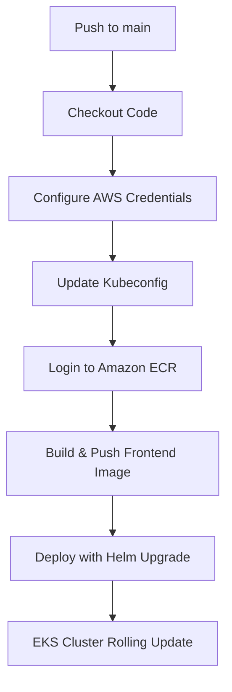

# CI/CD Pipeline Documentation

## Overview
This CI/CD pipeline implements a fully automated "GitOps" deployment flow. Any code change pushed to the `main` branch is built, tested (if configured), and deployed to our Amazon EKS cluster with zero manual intervention.

---

## Tools & Services Used
- **GitHub Actions:** CI/CD orchestrator.
- **Docker:** Containerization engine used to build the application image.
- **Amazon ECR (Elastic Container Registry):** Secure hosting for custom built container images.
- **AWS CLI & SDKs:** For authenticating and setting cluster contexts.
- **Helm:** Kubernetes package manager used to roll out configuration changes and deploy resources.

---

## Pipeline Workflow

The pipeline is defined in `.github/workflows/deploy-aws.yaml` and triggers automatically on pushes to the `main` branch (while ignoring paths like `docs/**`, `terraform/**`, and `README.md` to conserve resources).

### Steps in Detail:
1.  **Checkout Code:** Clones the GitHub repository into the GitHub Actions runner.
2.  **Configure AWS Credentials:** Authenticates using secrets stored in GitHub (`AWS_ACCESS_KEY_ID` and `AWS_SECRET_ACCESS_KEY`) targeting the AWS region `eu-central-1`.
3.  **Update Kubeconfig:** Fetches EKS cluster tokens and configures local `kubeconfig` to direct Kubernetes API traffic to the EKS cluster `staging-dev_ops`.
4.  **Login to Amazon ECR:** Obtains ECR authentication tokens using `aws-actions/amazon-ecr-login@v2` so Docker CLI can communicate with our registry.
5.  **Build & Push Image:**
    - Builds the Go frontend container image using `src/frontend/Dockerfile`.
    - Tags the image with the unique Git commit SHA (`github.sha`) to ensure traceability.
    - Pushes the image to the Amazon ECR registry (`frontend` repository).
6.  **Deploy with Helm:**
    - Runs `helm upgrade --install online-boutique ./helm-chart`.
    - Overrides values dynamically using:
      - `--set frontend.image.repository=<ECR_REGISTRY_URL>/frontend`
      - `--set frontend.image.tag=<COMMIT_SHA>`
    - Applies a rolling update on the EKS cluster with zero downtime.

---

## Automation Benefits
- **Zero-Downtime Deployments:** Kubernetes manages rolling updates, spinning up new frontend pods and verifying their readiness probes before shutting down older instances.
- **Reproducibility:** Eliminates "works on my machine" issues by standardizing the build environment in GitHub Actions container runners.
- **Security:** Secrets are injected directly into environment variables at runtime, keeping AWS credentials out of code repositories.
- **Speed & Efficiency:** By only building the modified `frontend` microservice and using cached/pre-built images for the rest of the services, the CI/CD pipeline completes in under 2 minutes.
